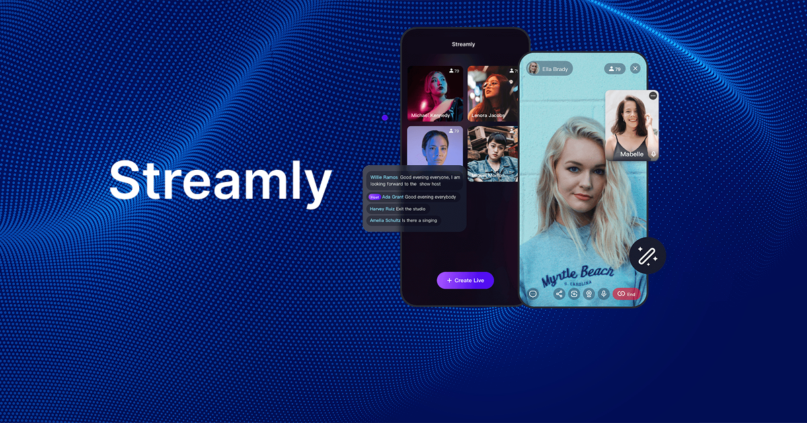

# Streamly - Live Streaming for Everyone

A live streaming Mini App that connects creators and communities through real-time video streaming, chat, and interactive features.



## Current Features

- 🎥 **Live Video Streaming** - Real-time video/audio streaming using Zego Express Engine
- 💬 **Live Chat** - Real-time messaging between viewers and hosts 
- 🎯 **Bullet Screen** - Messages that scroll across the screen for dynamic interaction
- ❤️ **Heart Reactions** - Interactive engagement with heart emoji reactions
- 👥 **Real-time Viewer Tracking** - Accurate unique viewer counting and participant list
- 🖼️ **Farcaster Integration** - Real profile pictures, usernames, and FIDs
- 📱 **Mobile-First Design** - Optimized for mobile streaming experience
- 🔒 **Mini App Security** - Only accessible within Farcaster and Base App
- 📊 **Database Integration** - Persistent storage with Supabase PostgreSQL
- 🪙 **Claim Tokens** - Daily on-chain $STRM claim on Base with wallet confirmation
- 📱 **Wallet Connect** - Wallet Connect using Appkit Provider

## Upcoming Features

- 🏆 **Streamers Leaderboard** - Track and display top streamers
- 👥 **Add/Invite Co-host** - Multi-host streaming capabilities
- 🖥️ **Share Screen** - Screen sharing functionality
- ✨ **AI Effects** - Face enhancement and filters
- 🎵 **Audio Effects** - Voice filters and audio enhancement
- ☁️ **Stream Cloud Recording** - Save and replay streams

## View the App

**To experience Streamly in action:**
- Click: [https://farcaster.xyz/miniapps/sPfnn2x8pvf7/streamly](https://farcaster.xyz/miniapps/sPfnn2x8pvf7/streamly)


## Tech Stack

- **Frontend**: Next.js 15, React 19, TypeScript, Tailwind CSS
- **Real-time Streaming**: Zego Express Engine WebRTC SDK
- **Database**: Supabase (PostgreSQL)
- **Farcaster Integration**: @farcaster/miniapp-sdk
- **UI Components**: Lucide React icons, custom components
- **Deployment**: Vercel

## Getting Started

### Prerequisites

1. **Farcaster Account** - Required for Mini App development
2. **Supabase Account** - Create a project at [supabase.com](https://supabase.com)
3. **Zego Account** - Sign up at [zegocloud.com](https://zegocloud.com) for streaming services
4. **Node.js 22+** - Required for development

### Setup

1. **Clone the repository**
   ```bash
   git clone https://github.com/oyingrace/streamly.git
   cd streamly
   ```

2. **Install dependencies**
   ```bash
   npm install
   ```

3. **Set up environment variables**
   ```bash
   cp env.example .env.local
   ```
   
   Fill in your environment variables:
   ```env
   # Supabase Configuration
   NEXT_PUBLIC_SUPABASE_URL=your_supabase_url
   NEXT_PUBLIC_SUPABASE_ANON_KEY=your_supabase_anon_key
   
   # Zego Configuration
   NEXT_PUBLIC_ZEGO_APP_ID=your_zego_app_id
   NEXT_PUBLIC_ZEGO_SERVER_URL=your_zego_server_url
   ZEGO_SERVER_SECRET=your_zego_server_secret
   ```

4. **Set up the database**
   - Go to your Supabase project SQL Editor
   - Run the schema file: `schema/01_create_tables.sql`
   - This creates all necessary tables for rooms, participants, and messages

5. **Configure Next.js for images**
   - The `next.config.ts` is already configured for miniapp profile images
   - Images from `imagedelivery.net` are whitelisted

6. **Run the development server**
   ```bash
   npm run dev
   ```

7. **Test the Mini App**
   - Use the Farcaster Mini App Preview Tool: [https://farcaster.xyz/~/developers/mini-apps/preview](https://farcaster.xyz/~/developers/mini-apps/preview)
   - Enter your deployed app url or You can use ngrok to expose your localhost server

## Usage

### For Hosts
1. **Create a Stream** - Click "Create Live" on the home page
2. **Start Broadcasting** - Click "Start Stream" to begin
3. **Interact with Audience** - See chat messages and heart reactions
4. **Manage Stream** - Use controls to mute/unmute, switch cameras, or end stream

### For Audience
1. **Browse Live Streams** - View all active streams on the home page
2. **Join a Stream** - Click on any live stream to join
3. **Engage** - Send chat messages, heart reactions, and interact with the host
4. **View Audience** - See who else is watching the stream

### Claim Tokens (Daily $STRM)

Claim a daily $STRM reward directly in the app header.

- **Prerequisites**:
  - A wallet on the Base network (inside Farcaster/Base app or an injected wallet supported by the Mini App)
  - A small amount of Base ETH for gas fees
- **How to claim**:
  1. Tap the "Claim" button in the header
  2. If prompted, connect your wallet
  3. Confirm the on-chain transaction in your wallet
  4. Wait for confirmation; a success modal will show your transaction with a BaseScan link
- **Limits**: One claim per 24 hours per wallet

**Network and Contracts**

```text
Network: Base Mainnet
DailyClaim: 0x0e72291f013cccf516a89381dd3966feedc63ef6
STRM Token: 0x2ce6620221d585cf8c8f5730581c781de5db4fc3
```

**Developer notes**
- Contract addresses and ABI are defined in `app/lib/contracts.ts`
- No additional env vars are required for claiming

**Troubleshooting**
- "You've already claimed today" → Wait until the 24-hour window resets
- "Claiming is temporarily disabled" → The contract is paused; try later
- "Insufficient funds for gas" → Add Base ETH to cover transaction fees
- Wallet won’t connect → Ensure you’re running inside the Farcaster/Base app environment


## Mini App Features

### Farcaster Integration
- **Real User Data** - Uses actual miniapp FIDs, usernames, and profile pictures
- **Embed Support** - Shareable embeds with rich previews in Farcaster & Mini App feeds
- **Environment Detection** - Only works within Farcaster and Base App
- **Background Fetching** - Real-time updates every 30 seconds

### Embed Configuration
The app includes embed meta tags for sharing in feeds:
- Rich preview images
- "🎥 Open Streamly" call-to-action button
- Direct Mini App launch functionality

## Learn More

- [Farcaster Mini Apps Documentation](https://docs.farcaster.xyz/developers/mini-apps)
- [Next.js Documentation](https://nextjs.org/docs)
- [ZegoCloud Documentation for Web](https://www.zegocloud.com/docs/live-streaming/overview?platform=web&language=javascript)
- [Supabase Documentation](https://supabase.com/docs)

## Contributing

Contributions are welcome! Please read our [CONTRIBUTING.md](CONTRIBUTING.md) file for detailed guidelines on how to contribute to this project. Please ensure all changes maintain compatibility with the Mini App environment.

---

**Built with ❤️ by [DevQueen](https://x.com/devqueen_)**
